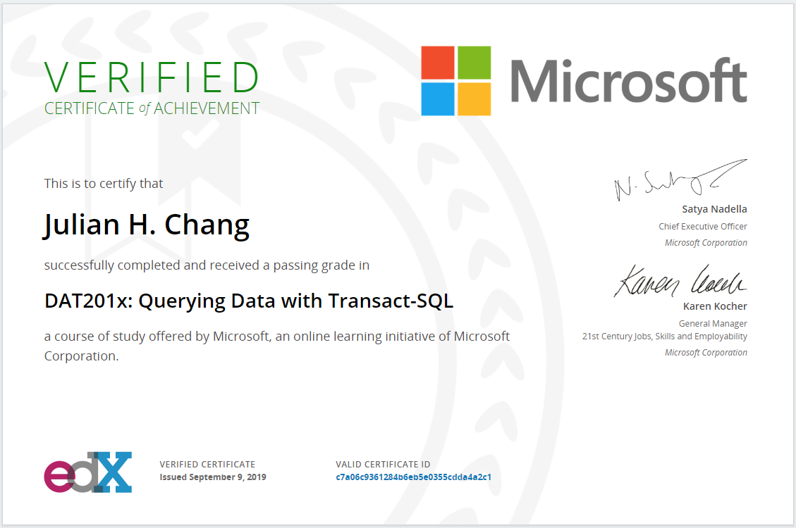
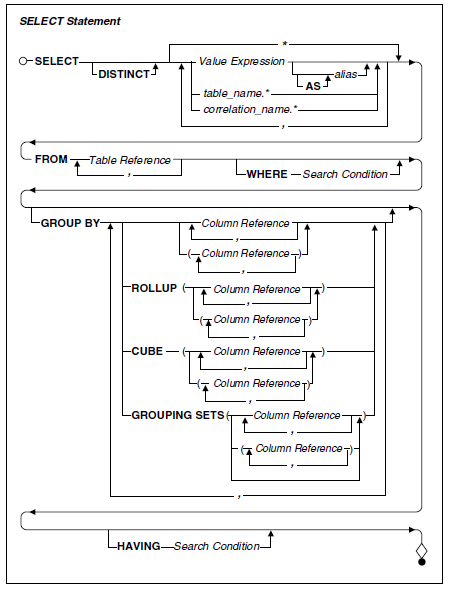
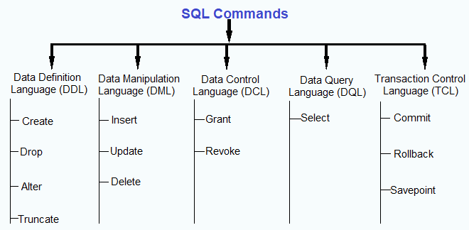

## Link: [EDX VERIFIED CERTIFICATE of ACHIEVEMENT](https://courses.edx.org/certificates/c7a06c9361284b6eb5e0355cdda4a2c1)

# Basic SQL Query Structure

SELECT
> You use it to specify the columns you want in the result set of your query. The columns themselves are drawn from the table or view you specify in the FROM clause. You can also use in this clause aggregate functions, such as Sum, or mathematical expressions, such as Quantity * Price.

\
FROM
> use the FROM clause to specify the tables or views from which to draw the columns you’ve listed in the SELECT clause.

\
WHERE
> You use it to filter the rows returned by the FROM clause. The WHERE keyword is followed by an expression, technically known as a predicate, that evaluates to true, false, or unknown. You can test the expression by using standard comparison operators, Boolean operators, or special operators.

\
GROUP BY
> When you use aggregate functions in the SELECT clause to produce summary information, you use the GROUP BY clause to divide the information into distinct groups. Your database system uses any column or list of columns following the GROUP BY keywords as grouping columns.

\
HAVING
> The HAVING clause filters the result of aggregate functions in grouped information. It is similar to the WHERE clause in that the HAVING keyword is followed by an expression that evaluates to true, false, or unknown. You can test the expression by using standard comparison operators, Boolean operators, or special operators.

\
ORDER BY
> This clause allows you to sort the result set of the specified SELECT statement by one or more columns and also provides the option of specifying an ascending or descending sort order for each column. The only columns you can use in the ORDER BY clause are those that are currently listed in the SELECT clause.
\
 

---
## SQL Commands
\
\

\
Data Definition Language (DDL): The DDL commands such as create, drop, alter and truncate is used for creating, dropping, altering and modifying the structure of database objects.

Data Manipulation Language (DML): The DML commands such as insert, update and delete are used for inserting, updating and deleting the structure of database objects.

Data Control Language (DCL): The DCL commands such as grant and revoke are used for providing security to database objects.

Data Query Language (DQL): The DQL command such as select is used for retrieving data from the database.

Transaction Control Language (TCL): TCL commands such as commit, rollback and savepoint is used for managing transactions in the database.
